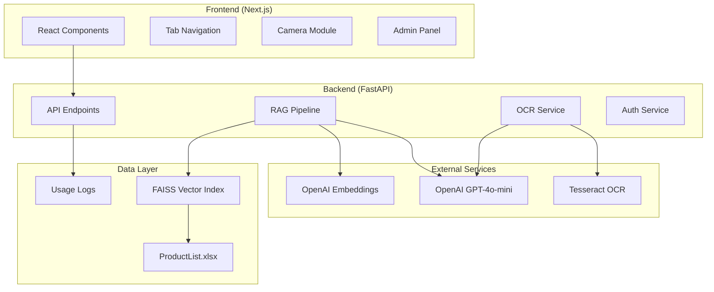
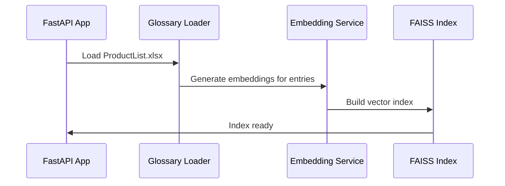
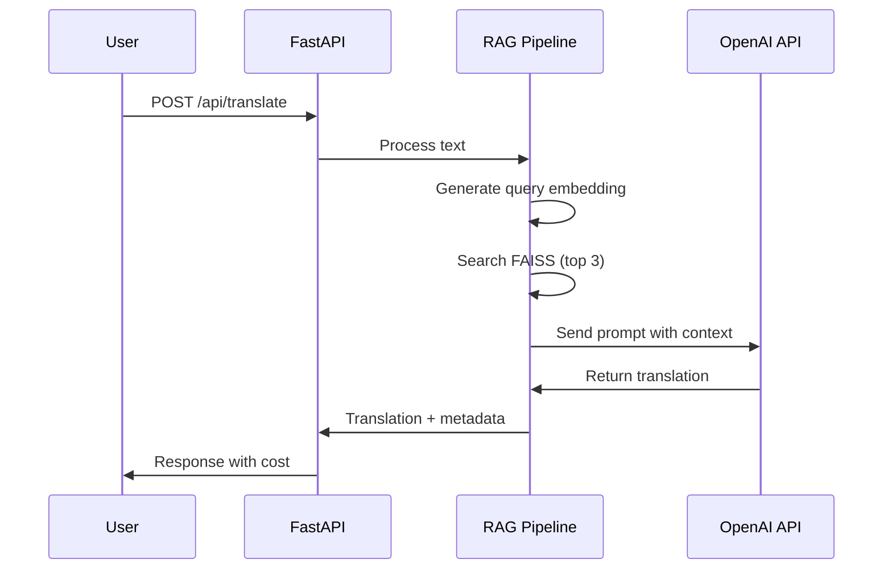
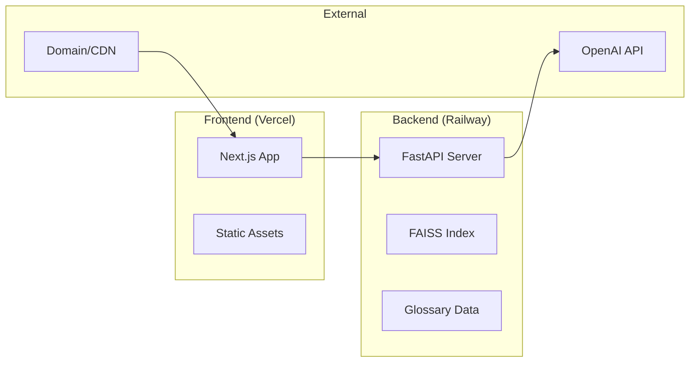

# Design Document

## Overview

FoodLang AI is a full-stack web application that provides bilingual food packaging translation services. The system combines a React/Next.js frontend with a Python FastAPI backend, utilizing OpenAI's GPT-4o-mini and RAG (Retrieval-Augmented Generation) for accurate food-specific translations.

## Architecture

### High-Level Architecture



### Technology Stack

**Frontend:**
- Next.js 14+ with App Router
- React 18+ with TypeScript
- Tailwind CSS for styling
- Shadcn/ui components
- React Hook Form for form handling
- Zustand for state management

**Backend:**
- Python 3.9+
- FastAPI framework
- FAISS for vector search
- OpenAI Python SDK
- Tesseract OCR (pytesseract)
- JWT for authentication
- Pandas for Excel processing

## Components and Interfaces

### Frontend Components

#### 1. Layout Components
- **Header**: Logo, subtitle, cost tracker badge
- **TabNavigation**: Four main tabs with icons
- **Footer**: Attribution and branding

#### 2. Translation Components
- **TextTranslator**: Main text input and translation interface
- **ResultCard**: Displays translation results with copy functionality
- **LanguageBadge**: Shows detected/target language

#### 3. Image Processing Components
- **ImageUploader**: Drag-and-drop file upload with preview
- **OCRMethodSelector**: Radio buttons for OCR method selection
- **CameraCapture**: Camera preview and capture controls
- **ImagePreview**: Shows uploaded/captured images

#### 4. Admin Components
- **LoginForm**: Username/password authentication
- **GlossaryManager**: Upload and manage glossary files
- **UsageStats**: Display cost and usage statistics
- **UpdateHistory**: Show recent glossary updates

#### 5. UI Components
- **LoadingSpinner**: For async operations
- **Toast**: Success/error notifications
- **Modal**: Confirmation dialogs
- **ProgressBar**: File upload progress

### Backend API Endpoints

#### 1. Translation Endpoints
```python
POST /api/translate
- Input: { text: string }
- Output: { translated_text: string, detected_language: string, cost: float }

POST /api/ocr
- Input: { image: File, method: "gpt4" | "tesseract" }
- Output: { extracted_text: string, detected_language: string, translation: string, cost: float }

GET /api/health
- Output: { status: string, glossary_loaded: boolean, glossary_entries: int }
```

#### 2. Admin Endpoints
```python
POST /api/auth/login
- Input: { username: string, password: string }
- Output: { token: string, expires_at: string }

GET /api/admin/glossary
- Headers: { Authorization: "Bearer <token>" }
- Output: { entries: int, total: int, last_updated: string }

POST /api/admin/glossary
- Headers: { Authorization: "Bearer <token>" }
- Input: { file: File }
- Output: { success: boolean, message: string, total: int }

GET /api/admin/usage
- Headers: { Authorization: "Bearer <token>" }
- Output: { total_cost: float, recent_logs: Array }
```

## Data Models

### Frontend State Models

```typescript
interface TranslationResult {
  translatedText: string;
  detectedLanguage: 'arabic' | 'english';
  cost: number;
}

interface OCRResult {
  extractedText: string;
  detectedLanguage: 'arabic' | 'english';
  translation: string;
  cost: number;
}

interface AdminState {
  isAuthenticated: boolean;
  token: string | null;
  glossaryStats: {
    entries: number;
    lastUpdated: string;
    fileSize: string;
  };
}

interface CostTracker {
  sessionCost: number;
  totalCalls: number;
}
```

### Backend Data Models

```python
class TranslationRequest(BaseModel):
    text: str

class OCRRequest(BaseModel):
    method: Literal["gpt4", "tesseract"]

class LoginRequest(BaseModel):
    username: str
    password: str

class GlossaryEntry(BaseModel):
    english: str
    arabic: str
    embedding: List[float]

class UsageLog(BaseModel):
    timestamp: datetime
    endpoint: str
    cost: float
    tokens_used: int
```

## RAG Pipeline Design

### 1. Initialization Phase


### 2. Translation Phase


### 3. Glossary Management
- **Loading**: Excel file parsed into memory on startup
- **Embedding**: Each glossary entry embedded using text-embedding-3-small
- **Indexing**: FAISS index built for fast similarity search
- **Updates**: New glossary triggers re-embedding and index rebuild

## Error Handling

### Frontend Error Handling
- **Network Errors**: Toast notifications with retry options
- **Validation Errors**: Inline form validation messages
- **Authentication Errors**: Redirect to login with error message
- **File Upload Errors**: Clear error messages with format requirements

### Backend Error Handling
- **API Rate Limits**: 429 status with retry-after header
- **Authentication Failures**: 401 status with clear error message
- **File Processing Errors**: 400 status with validation details
- **OpenAI API Errors**: Graceful fallback with user-friendly messages

### Error Response Format
```json
{
  "error": {
    "code": "TRANSLATION_FAILED",
    "message": "Unable to process translation request",
    "details": "OpenAI API temporarily unavailable"
  }
}
```

## Testing Strategy

### Frontend Testing
- **Unit Tests**: Component logic with Jest and React Testing Library
- **Integration Tests**: API integration and user flows
- **E2E Tests**: Critical paths with Playwright
- **Visual Tests**: Component snapshots and responsive design

### Backend Testing
- **Unit Tests**: Individual function testing with pytest
- **API Tests**: Endpoint testing with FastAPI TestClient
- **Integration Tests**: RAG pipeline and external API integration
- **Load Tests**: Performance testing for translation endpoints

### Test Coverage Goals
- Frontend: 80% code coverage
- Backend: 85% code coverage
- Critical paths: 100% coverage (auth, translation, file upload)

## Security Considerations

### Authentication & Authorization
- JWT tokens with 30-minute expiration
- Secure password hashing (bcrypt)
- CORS configuration for frontend domain
- Rate limiting on all endpoints

### Data Protection
- No persistent storage of user translations
- Secure handling of uploaded images (temporary storage)
- Environment variables for all secrets
- Input validation and sanitization

### API Security
- Request size limits for file uploads
- Content-type validation
- SQL injection prevention (parameterized queries)
- XSS protection through proper encoding

## Performance Optimization

### Frontend Optimization
- Code splitting by route and component
- Image optimization with Next.js Image component
- Lazy loading for non-critical components
- Service worker for offline functionality

### Backend Optimization
- FAISS index loaded in memory for fast search
- Connection pooling for external APIs
- Response caching for static data
- Async processing for file operations

### Monitoring & Metrics
- API response times
- Translation accuracy metrics
- Cost tracking and alerts
- Error rate monitoring

## Deployment Architecture

### Production Environment


### Environment Configuration
- **Development**: Local development with hot reload
- **Staging**: Preview deployments for testing
- **Production**: Optimized builds with monitoring

### Scaling Considerations
- Horizontal scaling for backend instances
- CDN for static asset delivery
- Load balancing for high traffic
- Database migration for persistent storage (future)